@ Mi proyecto
1.- Creo el proyecto
```bash
laravel new laravel-alumnos
```
Escogemos las siguientes opciones de configuración:

Utilizamos Breeze ya que va a crear la gestion de autenticación 

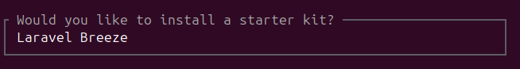

Utilizamos Blade para la parte gráfica

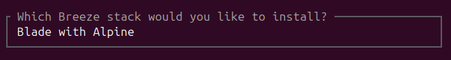

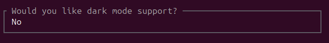

Elegimos Pest ya que no haremos pruebas unitarias

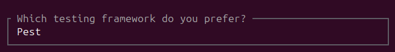

Utilizamos SQLite como base de datos

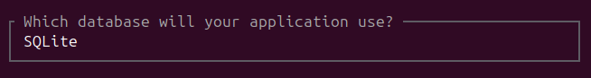


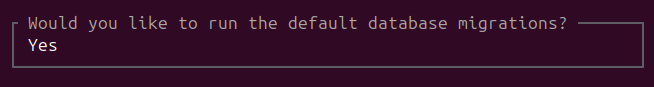

Procedemos a crear el layout principal, que contendrá a las demás secciones, referenciandolas mediante el <x-layouts-...>, siendo así componentes reutilizables Blade
el x sería la carpeta components donde se encuentra la carpeta layouts que contiene la página, e insertamos {{$slot}} 

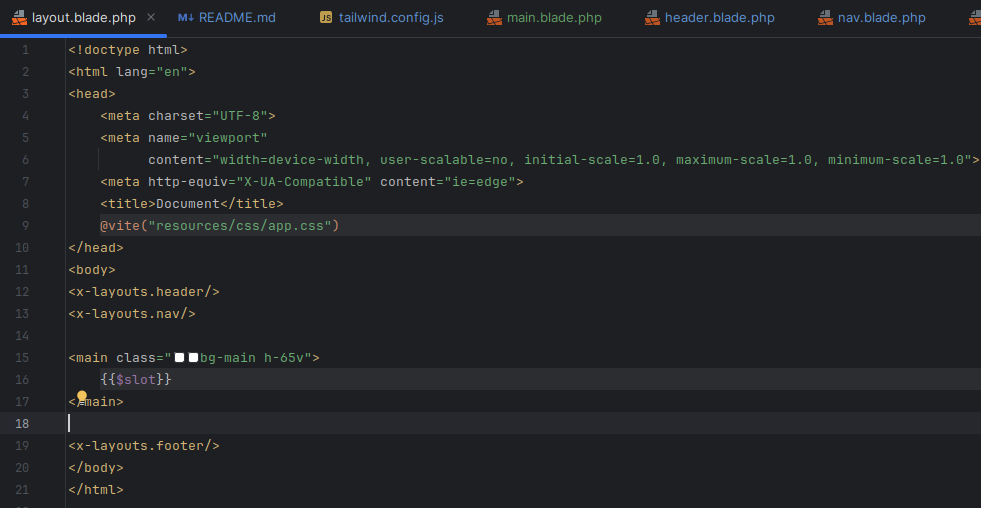


Luego creamos nuestros componentes restantes, el header, nav y footer.

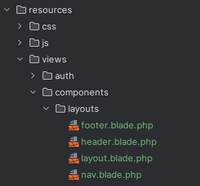

Para que se apliquen los estilos que deseamos, ingresamos en tailwind.config.js y agregamos los estilos predeterminados que deseemos
Para los estilos, instalamos Daysiui, que nos permitirá incluir clases en las etiquetas HTML para definir estilos, además que cuentan en su página web con estilos ya hechos para disitntas etiquetas

```bash
npm i -D daisyui@latest

```
Luego ingresamos a tailwind.config.js agregamos en la parte de plugins lo siguiente, y Daysi debería funcionar correctamente

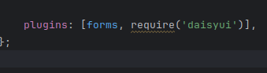

Para que se apliquen estilos predeterminados que deseamos, ingresamos en tailwind.config.js, y agregamos los estilos que queremos, agregamos el nombre de la propiedad que queremos que afecte,
y ponemos un alias con el que referenciaremos la clase, y lo que queremos que haga

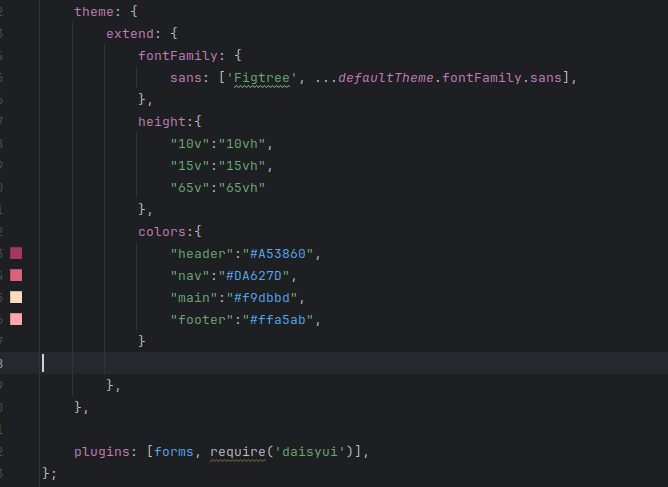

Una vez configurados los estilos, nos dirigimos a nuestra carpeta layouts y agregamos el contenido con su respectivo estilo a las páginas que tenemos, por ejemplo: 

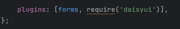

Una vez con daysiui configurado, agregamos el contenido necesario a las páginas en nuestra carpeta layout, y nos dirigimos a web.php, 
donde estableceremos que la página de inicio será nuestro main, como se aprecia en la imagen, la establecemos con alias main.

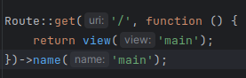

Una vez con eso configurado, queremos que al hacer login, no nos redirija a la página de login, sino que se quede en la página principal, por lo que en http/Controllers/Auth 
ingresamos a el controller encargado de autenticar la configuracion, y en la funcion de store, cambiamos el redirect de la ruta dashboard,
a main, utilizando el alias que le pusimos anteriormente.

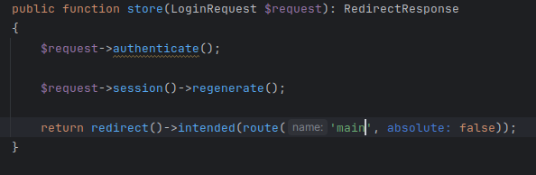


Nos dirigimos a la página login que tenemos en views/auth, y la envolvemos en <x-layouts.layout>
conviertiendola  en un componente reutilizable de Blade.

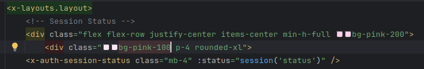

Finalizamos con cambiar el login de un boton a un enlace, y le especificamos la ruta al login.

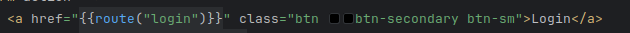

Podemos apreciar como el login ahora aparece en nuestra página principal. Todo este proceso es el mismo para que nuestra
página register aparezca en la principal como login.

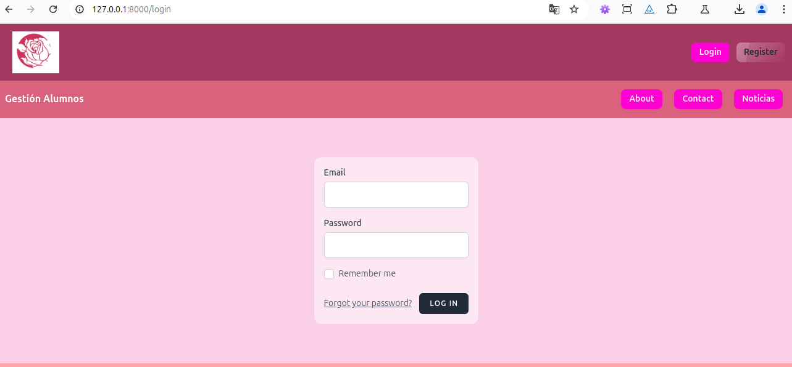


Además, cuando tengamos la sesión iniciada, queremos que nos aparezca el nombre del usuario y a la par un boton de logout, por lo que nos dirigimos al header 
que contiene los botones de login y register, y los envolvemos con @guest, lo que significa que aparecerán solo al no estar logueados, lo cerramos
y seguido abrimos un @auth, y dentro agregamos {{auth()->user()->name}}, lo que hace es que al estar autenticado pedira el nombre del usuario y lo mostrará, 
posteriormente agregamos el boton de logout, especificando la ruta logout y cerramos con @endauth.


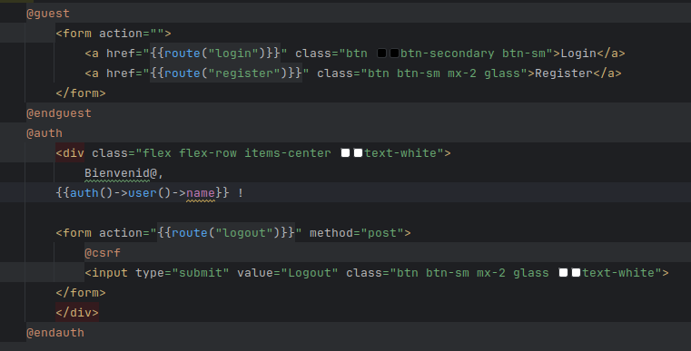

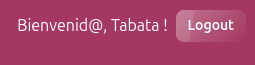

Al hacer login, queremos que nos cambie el contenido de la página principal, por lo que nos dirigimos a views y en main creamos nuevo contenido
y lo envolvemos en @auth, para que solo aparezca si ha iniciado sesión.

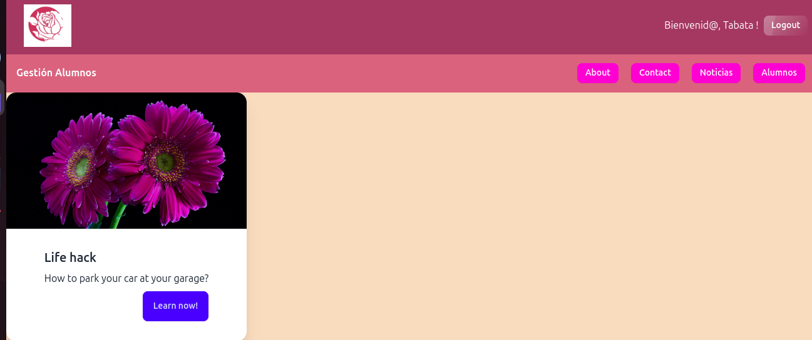

También deseamos que al hacer login, aparezca un boton llamado alumnos y me devuelva un listado alumnos,  por lo que creamos en views una página llamada alumnos y le devolvemos 
un h1 listado alumno, y lo envolvemos en nuestro <x-layouts.layout> para que sea un componente reutilizable de Blade. 

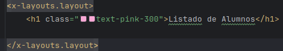

Procedemos a crear un controller donde crearemos la funcion que me devolverá la vista de la página alumnos.

```bash
php artisan make:controller AlumnoController

```
Dentro del controller creamos la función que me devolverá la vista de la página alumnos.

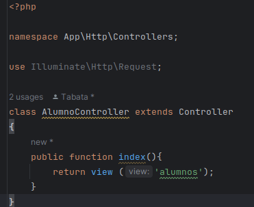

En routes, web.php, especificamos la ruta para llegar a alumnos, y especificamos AlumnoController y el nombre de la funcion, que devolverá la vista alumnos, y para confirmar que solo
se muestre si el alumno está autenticado, utilizamos el middleware, que lo verificará, y le damos un alias a la ruta, alumnos.


Y nos aseguramos que se especifique la ruta del AlumnoController, arriba de web.php con las demás rutas.

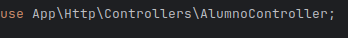

Solo nos queda crear el boton, que será un enlace donde le especificaremos la ruta alumnos, envuelto como hemos visto anteriormente, en @auth, cerrando con @endauth
para que nos aparezca solo si ha iniciado sesión.

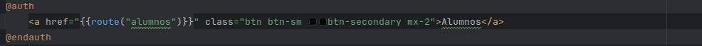

Podemos apreciar como funciona lo que hemos hecho previamente.

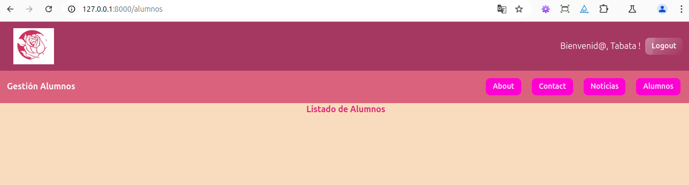
